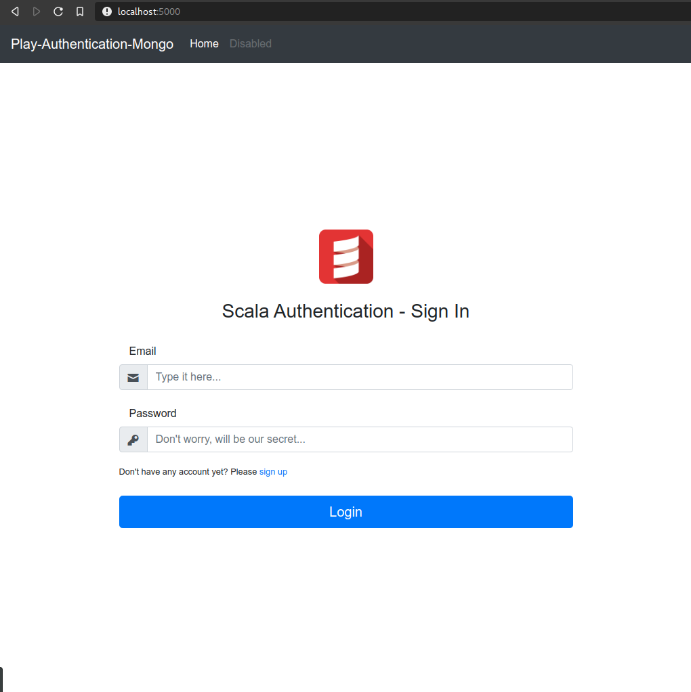

# Scala Play Authentication
* This repo is based from an [existing repo](https://github.com/seyuf/Rest-reactiveMongo-play2-auth) using **play2auth** library for authentication, but that repo
  uses **AngularJs** for views, in this repo you will find that everything is made in scala and for views
  I use **.scala.html* templates. In summary is a translation using full Scala.

### Requirements:
* Need **docker** and **docker-compose** installed,
  [here](https://docs.docker.com/compose/install/) you can find a the steps for the installation.
* Basic knowledge on Scala and MVC pattern desing.
* Basic knowledge on MongoDB in order to make easy queries on Database.

### How to run:
* As in requirements section was mentioned, we need to have installed **docker** to run this little project,
  using *docker-compose* tool we need to execute on terminal:
  
  ```docker
  $ docker-compose up
  Starting play-mongo
  Starting play-scala
  Attaching to play-mongo, play-scala
  play-mongo | 2020-03-10T16:16:44.704+0000 I CONTROL  [main] Automatically disabling TLS 1.0, to force-enable TLS 1.0 specify --sslDisabledProtocols 'none'
  play-mongo | 2020-03-10T16:16:44.715+0000 I CONTROL  [initandlisten] MongoDB starting : pid=1 port=27017 dbpath=/data/db 64-bit host=bdd2c4eb802e
  play-mongo | 2020-03-10T16:16:44.715+0000 I CONTROL  [initandlisten] db version v4.0.5
  play-mongo | 2020-03-10T16:16:44.715+0000 I CONTROL  [initandlisten] git version: 3739429dd92b92d1b0ab120911a23d50bf03c412
  play-mongo | 2020-03-10T16:16:44.715+0000 I CONTROL  [initandlisten] OpenSSL version: OpenSSL 1.0.2g  1 Mar 2016
  ...
  play-mongo | 2020-03-10T16:16:45.968+0000 I FTDC     [initandlisten] Initializing full-time diagnostic data capture with directory '/data/db/diagnostic.data'
  play-mongo | 2020-03-10T16:16:45.974+0000 I NETWORK  [initandlisten] waiting for connections on port 27017
  play-scala | [info] Loading project definition from /exampleapp/project
  play-scala | [info] Set current project to reactive-auth (in build file:/exampleapp/)
  play-scala | 
  play-scala | --- (Running the application, auto-reloading is enabled) ---
  play-scala | 
  play-scala | [info] play - Listening for HTTP on /0.0.0.0:9000
  play-scala | 
  play-scala | (Server started, use Ctrl+D to stop and go back to the console...)
  play-scala | 
  play-mongo | 2020-03-10T16:17:02.428+0000 I NETWORK  [listener] connection accepted from 172.26.0.1:57458 #1 (1 connection now open)
  play-mongo | 2020-03-10T16:17:02.428+0000 I NETWORK  [conn1] received client metadata from 172.26.0.1:57458 conn1: { application: { name: "Robomongo" }, driver: { name: "MongoDB Internal Client", version: "3.4.3-8-g05b19c6" }, os: { type: "Linux", name: "Ubuntu", architecture: "x86_64", version: "16.04" } }
  ```
  That command above means that we are just started the mongo and web server (scala) containers to start developing and have some fun.
  
* To start using it on browser just need to go to http://localhost:5000 on any browser. At the first time, Play won't start due to it needs to download all dependencies, just wait for it and you will this next:
  
  
* And that's it, feel free to make changes and start using it. Enjoy!!